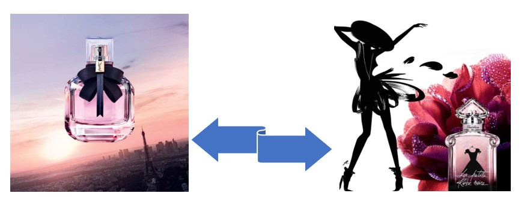

# Perfume_Recommendation
Perfume recommendation with feature based similarity

In this project I have used a dataset of 51000 fragrances with consumer input to build a recommendation system.  
This dataset was previously used for my project on exploratory data analysis and clustering of fragrance data.

Given my previous insight on the dataset, I have perfomed feature engineering in "frag_data_process" notebook with follwoing highlights:

I have excluded the fragrances with less than 200 votes, as they may not be available on most shopping websites, they are often tailored for acquired tastes, and the reviews may come from professionals receiving the product as complimentary gift.

Next step, the text data for perfume acchords (giving their general category) were processed to identify the first 3 accords of each perfume as important recommendation parameters. The test data for each accord is then trasnformed through one hot encoding to numerical values as input for recommender system.

The features with potential dependency to the main features and the ones which may not provide additional insight to the products were excluded.

Next step, the recommendation model was built in "feature_based_perfume_recom" notebook, considering the time and weather appropriate for the fragrance, the gender of users and the main accords as features showing similarity between products.

The model provides top 10 similar perfumes to a given perfume by user. It was tested by serveral friends and family members and they found the suggestions similar to the 
original selection and their taste. It can be implemented by both online and in-store perfume shops, increasing the chance of the costumers finding the scent they enjoy.

